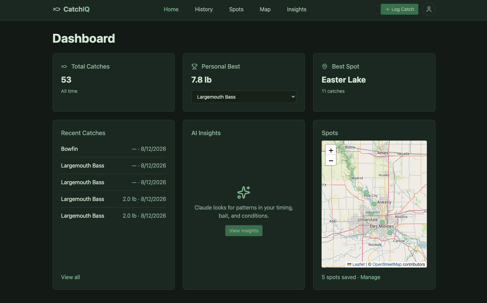
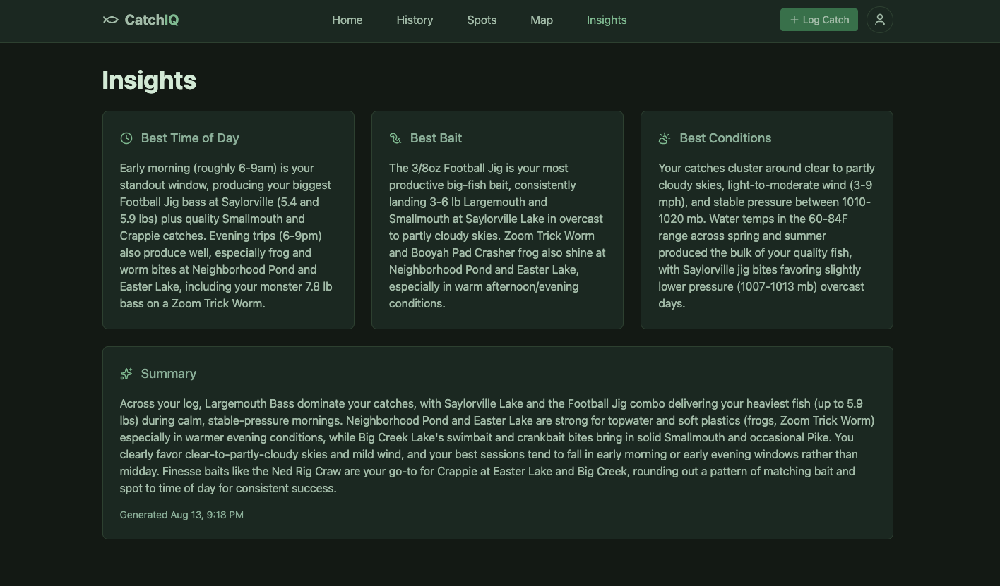

[](https://github.com/asmith183/CatchIQ/actions/workflows/ci.yml)
# CatchIQ 

A fishing catch tracking app. Log catches with species, bait, weather, and location data, then use AI
analytics over your catch history to find patterns and catch more fish.

## Features

- **Dashboard** — totals, personal bests by species, best spot, recent catches, and a saved-spots map at a glance
- **Catch logging** — species, bait, and spot pickers; location comes from the device via the browser
  Geolocation API, and the weather at that moment (air temp, wind, pressure, sky) is auto-filled from Open-Meteo
- **AI Insights** — Claude analyzes the full catch log and writes personalized best time of day, best bait,
  and best conditions breakdowns plus a summary
- **History** - searchable catch history





## Planned Features

- **Spots and Map** — save and edit custom spots, and an interactive Leaflet map

## Tech stack

**Backend:** .NET 10, ASP.NET Core Web API, EF Core 10, SQL Server, ASP.NET Identity + JWT, Swashbuckle,
Anthropic C# SDK

**Frontend:** React 19, TypeScript, Vite 8, Tailwind 4, React Router 7, React Leaflet, NSwag

**External services:** [Open-Meteo](https://open-meteo.com) (weather at catch time),
[Claude](https://claude.com/platform/api) (insight generation), OpenStreetMap tiles, browser Geolocation API

**Tooling:** GitHub Actions CI

## Architecture

### Controller → Manager → Engine → Accessor

| Layer | Responsibility |
| --- | --- |
| **Controller** | HTTP only: routing, model binding, status codes |
| **Manager** | Business rules, validation, orchestration across accessors |
| **Engine** | Reusable logic with no storage concerns (`TokenEngine` signs JWTs) |
| **Accessor** | EF Core data access |

Each layer sits behind an interface in DI. 

### Generated API client

The backend's OpenAPI document is fed to NSwag, which generates `src/api/generated.ts`: one typed client
per controller, with types matching the C# DTOs. 

Regenerate after changing a controller or DTO, with the backend running:

```bash
cd frontend && npm run generate-api
```

## Getting started

Requires the [.NET 10 SDK](https://dotnet.microsoft.com/download), [Node 22+](https://nodejs.org), and
[Docker](https://www.docker.com).

**1. Start SQL Server**

```bash
docker run -e "ACCEPT_EULA=Y" -e "MSSQL_SA_PASSWORD=CatchIQ_Dev1!" \
  -p 1434:1433 --name catchiq-mssql \
  -d mcr.microsoft.com/mssql/server:2022-latest
```

Later runs: `docker start catchiq-mssql`.

**2. Create `backend/appsettings.Development.json`** (gitignored; `appsettings.json` holds placeholders):

```json
{
  "ConnectionStrings": {
    "DefaultConnection": "Server=localhost,1434;Database=catchiq-mssql;User Id=sa;Password=CatchIQ_Dev1!;TrustServerCertificate=True;"
  },
  "Jwt": {
    "Secret": "replace-with-a-long-random-signing-key",
    "Issuer": "CatchIQ",
    "Audience": "CatchIQUsers"
  }
}
```

**3. Set the Anthropic API key** (optional — everything but Insights works without it):

```bash
cd backend && dotnet user-secrets set "Anthropic:ApiKey" "your-api-key"
```

**4. Apply migrations:**

```bash
cd backend && dotnet ef database update
```

**5. Set up the frontend env** (also gitignored; without it every API call hits the wrong URL):

```bash
cd frontend && cp .env.example .env
```

**6. Run both:**

```bash
cd backend && dotnet run --launch-profile http   # http://localhost:5045
cd frontend && npm install && npm run dev        # http://localhost:5173
```

## CI

`.github/workflows/ci.yml` builds both halves on every push and PR to `main`: `dotnet build -c Release`
against `CatchIQ.slnx`, and `npm ci` → lint → `npm run build` (which typechecks, unlike the dev server).
Client generation is excluded, since NSwag needs a running backend.
